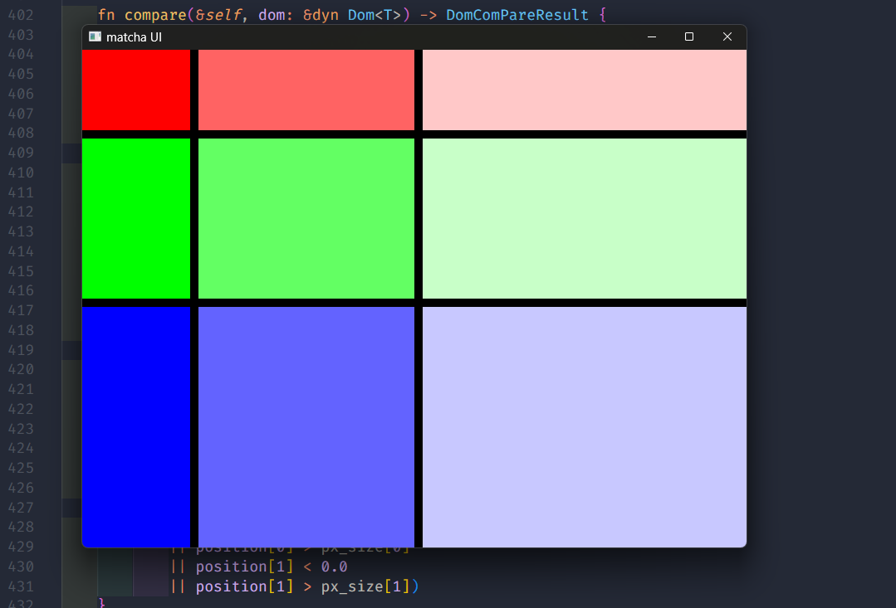

# matcha

A Rust GUI crate with a Vue-like Elm architecture, designed for frame-by-frame control. This crate is intended for integration into my open-source video editor project as frontend.

<!--
[Web DEMO(under preparation)](./)

[Official Site(under preparation)](./)
-->

## Current Status

🚧🚧🚧 **This crate/readme is under development.** 🚧🚧🚧

Development is underway with the goal of having a minimally functional version ready by around April 2025.

### Work in Progress

#### Increase/Decrease Example

#### Grid with gap, grow.

## Concepts and Goals

### 1. Able to control elements on each frame

### 2. Elm architecture

### 3. Vue-liked system

In this crate, core elements of the Elm architecture such as Model, View, Update, and Message are managed as components. Each component can pass messages to its child components within its update function. Events triggered by widgets within a component are first handled by that component, and the component can also emit events to its parent.

### 4. Minimum runtime error

### 5. Extensibility

---

## Supported OS

---

## Widgets

---

## Usage

---

## Integration

---

## Minimum Supported Rust Version

---

## About development
